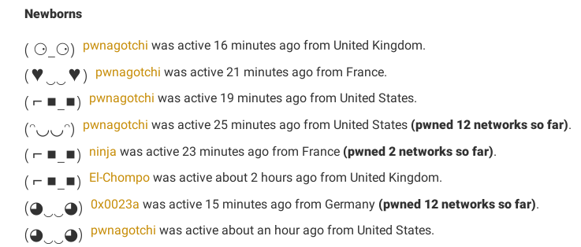

# My pwnagotchi setup
I will show you how I managed to set my pwnagotchi up !

## Summary
* [What is this ?](#what-is-this-)
* [Hardware](#hardware)
* [Configuration](#configuration)
* [Other](#other)

## What is this ?
> So first, what is a pwnagotchi you might ask ?

As it is already well-resumed on [the official website](https://pwnagotchi.ai), a pwnagotchi is a cute little creature running on a Rapberry or any Unix machine, which will capture Wi-Fi handshakes using a learning artificial intelligence. Moreover, it is provided with a bettercap integration which will help us to maximize our success.

Getting a pwnagotchi is not expensive and very cool to configure, I will show you what hardware I use for it.



## Hardware
I bought a Raspberry Pi Zero W (RPi0) for about 13€ ($14.5), you can search for one [here](https://www.raspberrypi.org/products/raspberry-pi-zero-w/). With that I purchased an external battery with a 24800mAh capacity (I don't remember the price sorry).
I also got myself an SD card with enough capacity (32Gb). On top of that I got a Waveshare 2.13" screen, [look here](https://www.waveshare.com/2.13inch-e-paper-hat.htm) for one. Of course, you will have to get yourself an USB cable capable of tranfering data, and not only charging.

And that's all !

Resume :
* RPi0W
* 32Gb SD card
* 2.13" screen
* External battery
* Data USB cable

## Configuration
### Setup
First I flashed the SD card with the [lastest pwnagotchi image](https://github.com/evilsocket/pwnagotchi/releases) :
* Windows
[Flash software](https://www.balena.io/etcher/)
Select the `.img` file you downloaded, your SD card and hit 'flash' !
* Linux
```bash
dd if=pwnagotchi.img of=/dev/sdXX bs=1M
```

### Config
After the SD card got flashed, I created the `config.yml` file in the `boot` partition of the SD card, here is my configuration :
```yml
main:
  name: 'your pwnagotchi name'
  whitelist:
    - maybe_your_own_network
  plugins:
    grid:
      enabled: true
      report: true
      exclude:
        - maybe_you_own_network
ui:
  display:
    enabled: true
    type: 'waveshare_2'
    color: 'black'
```
Now it is ready to boot ! I pluged the SD card into the RPi0W, pluged the external battery and waited (you need to wait a little bit at first boot because the pwnagotchi is generating its RSA keys, can take up to 10 minutes).

That is all the configuration you need to give birth.

## Other
### Accessing the pwnagotchi
To access your pwnagotchi, plug the data port of the RPi0W on your computer, you should be able to see a new interface (generaly called `usb0` or `enp0s20f0u4i1` or something similar).
> Tip : write somewhere the name of this interface for latter config or connections

You need to configure this interface with those settings :
* @IP : `10.0.0.1`
* netmask : `255.255.255.0` or `/24`

You should be able to ping your pwnagotchi (`10.0.0.2` or `your_pwnagotchi_name.local`).
You can now ssh to it with the credentials `pi:raspberry`.
> Tip : change the default password with the command `passwd`
>
> Tip 2 : upload your SSH public key to your pwnagotchi to easily connect to it or create backups : `ssh-copy-id -i ~/.ssh/id_rsa.pub pi@10.0.0.2`

### Share internet with your pwnagotchi
You will need to share internet with your pwnagotchi if you want it to update or share its treasures on the grid.
Download the [corresponding script](https://pwnagotchi.ai/configuration/#host-connection-sharing) on your computer, change the default values with yours, make the script executable, and run it ! That's all.

### Bash aliases
Yay aliases are cool !
pwnagotchi's `.bashrc` :
```bash
alias pwn_handshakes='sudo ls -al /root/handshakes'
alias pwn_version='python3 -c "import pwnagotchi as p; print(p.version)"'
alias pwn_log='tail -f -n300 /var/log/pwn* | sed --unbuffered "s/,[[:digit:]]\{3\}\]//g" | cut -d " " -f 2-'
alias pwn_backup='/etc/pwnagotchi/scripts/backup.sh 10.0.0.1 pwnagotchi_backup.zip'
```
